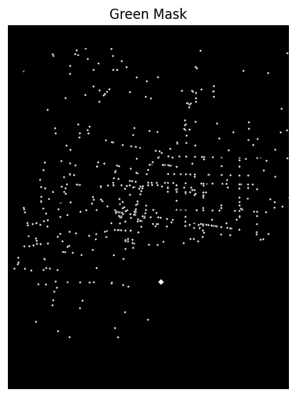
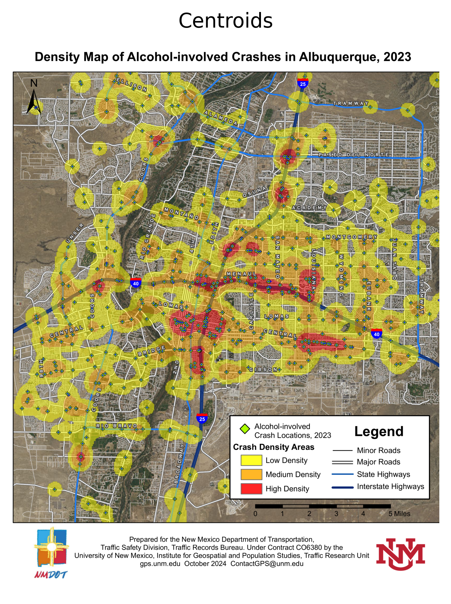

# nm-2023-alcohol-crash-data

This project extracts spatial features from a static map image (e.g., green symbols or markers) that represent locations in Albuquerque. The motivation behind this script is to bypass the high costs of accessing this data from NMDOT (~$2,000) by extracting the information manually using computer vision and georeferencing techniques.

# Purpose

Extract features (e.g., green blobs) from an image using OpenCV.
Identify their centroids while avoiding a known reference point.
Georeference those centroids using manually provided Ground Control Points (GCPs).
Visualize those features on both the original image and an actual basemap.
Export the resulting geographic coordinates as a CSV for use in other projects.

# Dependencies

This script relies on the following Python packages:

opencv-python
numpy
matplotlib
pandas
scikit-learn
geopandas
shapely
contextily
Install with:

pip install opencv-python numpy matplotlib pandas scikit-learn geopandas shapely contextily

# Input Files

albuquerque.png: The source image containing the visual markers.
gcp.csv: A CSV file with known pixel coordinates and their corresponding latitude/longitude. Must contain:
pixel_x
pixel_y
lat
lon

# What the Script Does

1. **Load and display the source image.**  
   

2. **Convert it to HSV color space to isolate green-colored features using a specified color range.**  
   **Apply masking and contour detection to extract features (blobs).**  
   

3. **Calculate centroids of those blobs, excluding any that are too close to a reference point (e.g., a map legend).**  
   

4. **Overlay GCPs on the image and a real-world basemap for sanity checks.**

5. **Fit linear regression models to transform pixel coordinates into geographic coordinates.**  
   **Predict GPS positions of the detected centroids.**  
   **Visualize results side-by-side (image and map).**  
   

6. **Export results to `centroid_geocoordinates.csv`.**

# Output

centroid_geocoordinates.csv: A list of detected features with their estimated latitude and longitude.

# Notes

This is a workaround to manually replicate a geospatial dataset using image processing.
The accuracy of GPS predictions depends heavily on the precision and number of GCPs provided.
HSV thresholds may need tweaking for different images or color schemes.